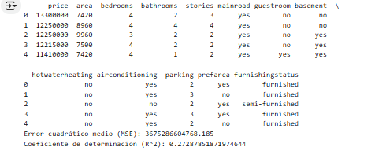
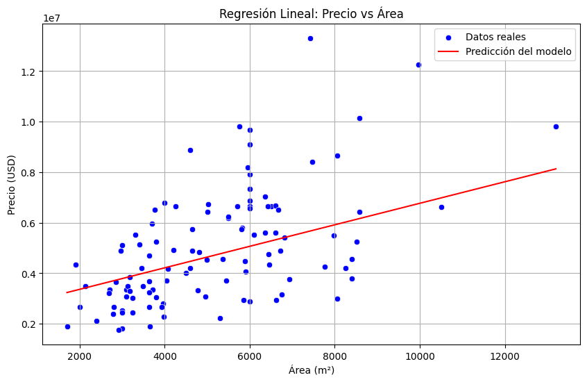
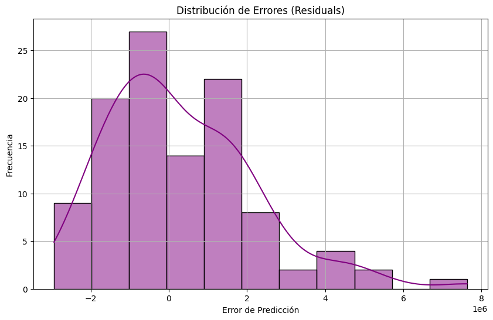

# 🏡 Predicción de Precios de Casas

Este proyecto implementa un modelo de **Regresión Lineal** utilizando **Python** y la biblioteca **scikit-learn** para predecir el precio de una casa basado en su área y otras características relevantes. 🚀

---

## 📦 Integrantes

Daniel Ortega
Hernán Abad
Rubén Tocain
Danny Diaz
Edwin Simbaña

---

## 📦 Estructura del Proyecto

```
caso3UHE-clean/
├── model/
│   ├── train.py
│   └── model.pkl
├── data/
│   └── Housing.csv
├── app.py
├── requirements.txt
└── README.md
```

---

## ⚙️ Requisitos

Instala las dependencias ejecutando:

```bash
pip install -r requirements.txt
```

### `requirements.txt`

```
flask
numpy
scikit-learn
pickle5
gunicorn
pandas
matplotlib
seaborn
```

---

## 🚀 Ejecución del Proyecto

1️⃣ Clona el repositorio:

```bash
git clone https://github.com/sucoabad/caso3UHE-clean.git
cd caso3UHE-clean
```

2️⃣ Ejecuta el script de entrenamiento:

```bash
python model/train.py
```

3️⃣ Inicia la aplicación web:

```bash
gunicorn app:app --bind 0.0.0.0:8080
```

4️⃣ Accede a la aplicación en `http://localhost:8080`.

---

## ☁️ CI/CD con Google Cloud Run

Este proyecto está configurado para implementarse automáticamente en **Google Cloud Run** utilizando **GitHub Actions**.

### 🗂️ Pipeline de CI/CD

- **Clonación del repositorio**
- **Autenticación con Google Cloud**
- **Construcción de la imagen Docker**
- **Push a Google Artifact Registry**
- **Despliegue en Cloud Run**

### 🔑 Configuración de GitHub Actions

```yaml
name: CI/CD Pipeline

on:
  push:
    branches:
      - main

jobs:
  deploy:
    runs-on: ubuntu-latest

    steps:
      - name: Checkout del código
        uses: actions/checkout@v3

      - name: Autenticación en Google Cloud
        uses: google-github-actions/auth@v1
        with:
          credentials_json: ${{ secrets.GCP_SA_KEY }}

      - name: Configurar Docker para Artifact Registry
        run: gcloud auth configure-docker us-central1-docker.pkg.dev

      - name: Construir y subir la imagen Docker
        run: |
          docker build -t us-central1-docker.pkg.dev/caso3uhe/mi-repo-docker/caso3uhe-clean:latest .
          docker push us-central1-docker.pkg.dev/caso3uhe/mi-repo-docker/caso3uhe-clean:latest

      - name: Desplegar en Cloud Run
        run: |
          gcloud run deploy caso3uhe \
            --image us-central1-docker.pkg.dev/caso3uhe/mi-repo-docker/caso3uhe-clean:latest \
            --platform managed \
            --region us-central1 \
            --allow-unauthenticated
```

---

## 📊 Visualización de Resultados

### Gráfico de Dispersión (Área vs Precio)

```python
import matplotlib.pyplot as plt
import seaborn as sns

plt.figure(figsize=(10, 6))
sns.scatterplot(x=df['area'], y=df['price'], color='blue')
plt.plot(df['area'], modelo.predict(df[['area']]), color='red')
plt.xlabel('Área (m²)')
plt.ylabel('Precio (USD)')
plt.title('Relación entre Área y Precio')
plt.show()
```

### Ejemplo del Gráfico:






---

## 📈 Ejemplo de Predicción

```python
from flask import Flask, request, jsonify
import pickle
import numpy as np

app = Flask(__name__)

# Cargar el modelo entrenado
with open('model/model.pkl', 'rb') as f:
    modelo = pickle.load(f)

@app.route('/predict', methods=['POST'])
def predict():
    data = request.get_json()
    area = np.array([[data['area']]])
    prediction = modelo.predict(area)
    return jsonify({'predicted_price': prediction[0]})

if __name__ == '__main__':
    app.run(host='0.0.0.0', port=8080)
```

---

## 🤝 Contribuciones

¡Las contribuciones son bienvenidas! 🚀

1️⃣ Haz un fork del repositorio.  
2️⃣ Crea una nueva rama (`git checkout -b feature-nueva`).  
3️⃣ Realiza tus cambios y haz commit (`git commit -m 'Nueva funcionalidad'`).  
4️⃣ Sube tus cambios (`git push origin feature-nueva`).  
5️⃣ Abre un **Pull Request**.

---

## 📄 Licencia

Este proyecto está bajo la licencia [MIT](LICENSE).

---

## 🙋‍♂️ Contacto

**Autor:** [sucoabad](https://github.com/sucoabad)  
📧 Correo: sucoabad@hotmail.com  
🌍 GitHub: [https://github.com/sucoabad/caso3UHE-clean](https://github.com/sucoabad/caso3UHE-clean)

---

¡Gracias por visitar este proyecto! 🚀


